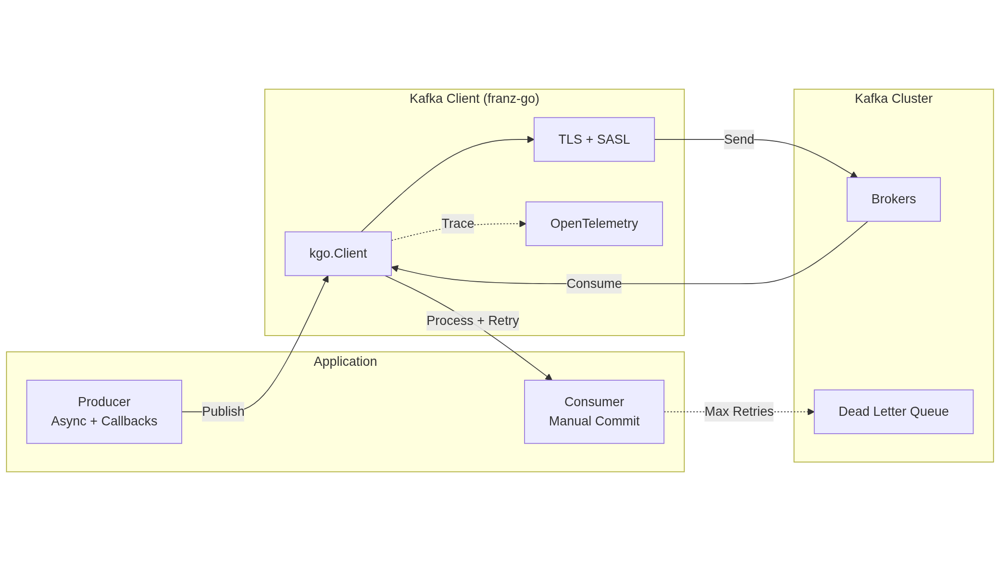

# Go Template Project

This project is a Go template demonstrating reusable packages and runnable example services.

## API (Swagger)
```
http://localhost:8080/swagger/index.html
```

## Project Structure
```
├── cmd/                               # Runnable applications
│   ├── myapp/                         # Main application
│   │   └── main.go                    # Entry point
│   └── examples/                      # Example applications (empty placeholder)
│
├── internal/                          # Internal services (not importable externally)
│   ├── app/                           # Application initialization
│   │   ├── bootstrap/                 # Component initialization (DB, cache, OAuth2, Kafka, OTEL)
│   │   │   ├── cache.go               # Redis cache initialization
│   │   │   ├── migrations.go          # Database migrations
│   │   │   ├── oauth2.go              # OAuth2 provider setup
│   │   │   └── otel.go                # OpenTelemetry setup
│   │   ├── health/                    # Health check endpoints
│   │   │   └── checker.go             # Health check implementation
│   │   ├── middleware/                # HTTP middleware (auth, logging, request ID, CORS)
│   │   │   ├── auth.go                # Authentication middleware
│   │   │   ├── cors.go                # CORS middleware
│   │   │   ├── logging.go             # Request logging middleware
│   │   │   └── request_id.go          # Request ID middleware
│   │   ├── routes/                    # HTTP route setup
│   │   │   ├── auth.go                # Auth routes
│   │   │   └── infra.go               # Infrastructure routes (health, metrics)
│   │   ├── server.go                  # Server setup, lifecycle management
│   │   ├── provider.go                # Dependency injection provider
│   │   └── README.md                  # App architecture documentation
│   ├── db/                            # Database layer
│   │   └── generated/                 # sqlc generated code
│   └── service/                       # Domain services
│       ├── auth/                      # Authentication service
│       │   ├── handler.go             # HTTP handlers (Gin)
│       │   ├── repository.go          # Data access layer
│       │   ├── service.go             # Business logic
│       │   └── types.go               # DTOs and models
│       └── session/                   # Session service
│           ├── client.go              # Session client interface
│           ├── redis_session.go       # Redis session implementation
│           └── redis_session_test.go  # Session tests
│
├── pkg/                               # Reusable library packages
│   ├── cache/                         # Cache interfaces, Redis helpers
│   ├── db/                            # Database connectors, helpers
│   ├── idgen/                         # ID generation utilities
│   ├── kafka/                         # Kafka client and helpers with OpenTelemetry metrics
│   │   └── README.md                  # Kafka package documentation
│   ├── logger/                        # Zerolog wrapper & helpers
│   ├── oauth2/                        # OAuth2 manager & token helpers
│   └── passkey/                       # Passkey/WebAuthn utilities
│
├── db/                                # Database-related files
│   ├── migrations/                    # SQL migration files
│   └── queries/                       # SQL query files for sqlc
│
├── api/                               # API specifications
│   ├── docs.go                        # Swagger documentation
│   ├── swagger.yaml                   # OpenAPI spec
│   └── swagger.json                   # OpenAPI spec (JSON)
│
├── cfg/                               # Centralized config loading
│   └── config.go
│
├── otel/                              # Monitoring & tracing configs
│   ├── config.alloy                   # Alloy OTel config
│   ├── loki.yaml                      # Loki logging config
│   ├── prometheus.yml                 # Prometheus metrics config
│   └── grafana-datasources.yaml       # Grafana datasources
│
├── img/                               # Documentation images
├── docs/                              # Documentation
├── AGENTS.md                          # Agent coding guidelines
├── Makefile                           # Build commands
├── sqlc.yaml                          # sqlc configuration for type-safe SQL
├── docker-compose.yml                 # Local services
├── Dockerfile                         # Container image
├── Dockerfile.examples                # Example services container
├── add-secrets.sh                     # Secrets management helper
├── test.http                          # API testing file
└── .env.example                       # Environment variables template
```

## OpenTelemetry

This project implements a comprehensive observability stack using OpenTelemetry (OTEL) for distributed tracing, metrics, and logging.


1. **Metrics**: Application → OTLP Receiver → Batch Processor → Prometheus Exporter → Prometheus (via remote_write)
2. **Docker Logs**: Application (Zerolog JSON) → Docker stdout → Alloy Docker Log Scraper → Loki Process → Loki Write → Loki

## Database & SQL Code Generation (sqlc)

This project uses **[sqlc](https://docs.sqlc.dev/)** for type-safe SQL code generation. sqlc generates Go code from SQL queries, providing compile-time safety and eliminating the need for ORMs.

## Kafka Architecture

The project provides a robust Kafka client implementation using [franz-go](https://github.com/twmb/franz-go) with OpenTelemetry integration for observability.



### Features

- **Producer** (`producer.go`): Synchronous message production with JSON serialization
- **Consumer** (`consumer.go`): Manual offset management, graceful shutdown support, per-record error handling
- **Client** (`client.go`): Configured with production-ready defaults (retries, compression, batching)
- **Observability**: Built-in OpenTelemetry metrics and tracing via franz-go kotel plugin
- **Error Handling**: Comprehensive error handling with slog logging throughout
