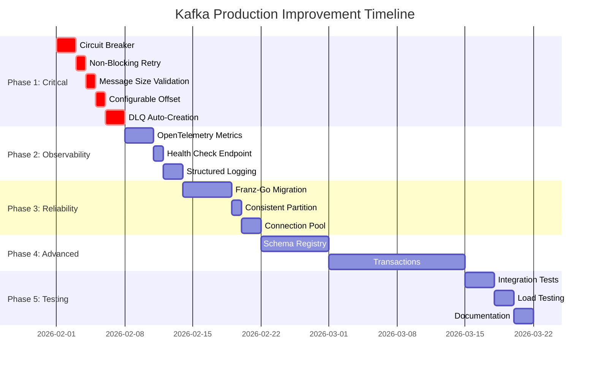

# Kafka Production Improvement Plan

## Executive Summary

This document outlines a phased approach to transforming the current Kafka implementation into a production-grade system. The plan is divided into 5 phases, prioritized by business impact and risk.

---

## Phase 1: Critical Production Blockers (2-3 weeks)

### 1.1 Circuit Breaker Pattern

**Priority**: Critical  
**Effort**: 2 days  
**Impact**: Prevents cascading failures

**Implementation**:

```go
// pkg/kafka/circuitbreaker.go
package kafka

import (
    "sync"
    "time"
)

type CircuitState int

const (
    StateClosed CircuitState = iota   // Normal operation
    StateOpen                          // Failing, reject requests
    StateHalfOpen                      // Testing if recovered
)

type CircuitBreakerConfig struct {
    FailureThreshold int           // Number of failures before opening
    Timeout          time.Duration // Time before attempting reset
    HalfOpenMaxCalls int           // Max calls in half-open state
}

type CircuitBreaker struct {
    config    CircuitBreakerConfig
    state     CircuitState
    failures  int
    lastError time.Time
    mu        sync.RWMutex
}

func NewCircuitBreaker(cfg CircuitBreakerConfig) *CircuitBreaker {
    return &CircuitBreaker{
        config: cfg,
        state:  StateClosed,
    }
}

func (cb *CircuitBreaker) Execute(fn func() error) error {
    if !cb.allow() {
        return ErrCircuitBreakerOpen
    }
    
    err := fn()
    cb.recordResult(err)
    return err
}

func (cb *CircuitBreaker) allow() bool {
    cb.mu.RLock()
    defer cb.mu.RUnlock()
    
    switch cb.state {
    case StateClosed:
        return true
    case StateOpen:
        if time.Since(cb.lastError) > cb.config.Timeout {
            cb.mu.RUnlock()
            cb.mu.Lock()
            cb.state = StateHalfOpen
            cb.failures = 0
            cb.mu.Unlock()
            cb.mu.RLock()
            return true
        }
        return false
    case StateHalfOpen:
        return cb.failures < cb.config.HalfOpenMaxCalls
    default:
        return false
    }
}

func (cb *CircuitBreaker) recordResult(err error) {
    cb.mu.Lock()
    defer cb.mu.Unlock()
    
    if err == nil {
        cb.failures = 0
        cb.state = StateClosed
        return
    }
    
    cb.failures++
    cb.lastError = time.Now()
    
    if cb.state == StateHalfOpen || cb.failures >= cb.config.FailureThreshold {
        cb.state = StateOpen
    }
}
```

**Integration Points**:
- Wrap `producer.Publish()` calls
- Wrap consumer connection attempts
- Configure via environment variables

---

### 1.2 Non-Blocking Retry with Context

**Priority**: Critical  
**Effort**: 1 day  
**Impact**: Prevents consumer blocking during retries

**Current Problem** ([`consumer.go:95`](pkg/kafka/consumer.go:95)):
```go
// ❌ BLOCKS consumer loop
time.Sleep(delay)
```

**Solution**:
```go
// pkg/kafka/consumer.go - processMessageWithRetry function
func (c *KafkaConsumer) processMessageWithRetry(
    ctx context.Context,
    message Message,
    handler ConsumerHandler,
    retryCount int,
    firstFailedAt time.Time,
) error {
    // ... existing code ...
    
    for attempt := 0; attempt < shortRetries; attempt++ {
        handlerErr = handler(message)
        if handlerErr == nil {
            return nil
        }
        
        if ctx.Err() != nil {
            return ctx.Err()
        }
        
        if attempt < shortRetries-1 {
            delay := calculateBackoff(c.retryCfg.InitialBackoff, c.retryCfg.MaxBackoff, attempt)
            
            // ✅ Non-blocking sleep with context cancellation
            timer := time.NewTimer(delay)
            select {
            case <-timer.C:
                // Continue to next attempt
            case <-ctx.Done():
                timer.Stop()
                return ctx.Err()
            }
        }
    }
    
    // ... rest of function ...
}

func calculateBackoff(initialBackoff, maxBackoff int64, attempt int) time.Duration {
    // Add jitter to prevent thundering herd
    delay := time.Duration(initialBackoff) * time.Millisecond * time.Duration(1<<attempt)
    if delay > time.Duration(maxBackoff)*time.Millisecond {
        delay = time.Duration(maxBackoff) * time.Millisecond
    }
    
    // Add 0-20% jitter
    jitter := time.Duration(float64(delay) * 0.2 * (0.5 - time.Now().UnixNano()%100)/100)
    return delay + jitter
}
```

---

### 1.3 Message Size Validation

**Priority**: Critical  
**Effort**: 1 day  
**Impact**: Prevents broker rejection and client hangs

**Implementation**:

```go
// pkg/kafka/producer.go
const (
    defaultMaxMessageSize = 1 * 1024 * 1024  // 1MB default
    kafkaMaxMessageSize   = 10 * 1024 * 1024 // 10MB Kafka limit
)

func (p *KafkaProducer) Publish(ctx context.Context, msg Message) error {
    // Validate message size
    totalSize := len(msg.Key) + len(msg.Value)
    for k, v := range msg.Headers {
        totalSize += len(k) + len(v)
    }
    
    if totalSize > p.maxMessageSize {
        p.logger.Error(ctx, "Message exceeds maximum size",
            logger.Field{Key: "size", Value: totalSize},
            logger.Field{Key: "max_size", Value: p.maxMessageSize},
            logger.Field{Key: "topic", Value: msg.Topic})
        return fmt.Errorf("%w: %d bytes exceeds limit of %d", ErrMessageTooLarge, totalSize, p.maxMessageSize)
    }
    
    // ... rest of publish logic ...
}
```

**Configuration**:
```go
// pkg/kafka/types.go
type ProducerConfig struct {
    // ... existing fields ...
    MaxMessageSize int // Maximum message size in bytes
}
```

---

### 1.4 Configurable Consumer Start Offset

**Priority**: High  
**Effort**: 1 day  
**Impact**: Flexibility for different consumer scenarios

**Implementation**:

```go
// pkg/kafka/types.go
type StartOffset int

const (
    StartOffsetEarliest StartOffset = iota // Read from beginning
    StartOffsetLatest                      // Read from end (real-time)
    StartOffsetNone                        // Fail if no offset exists
)

type ConsumerConfig struct {
    // ... existing fields ...
    StartOffset StartOffset
}
```

```go
// pkg/kafka/consumer.go - NewKafkaConsumer function
func NewKafkaConsumer(cfg *ConsumerConfig, brokers []string, groupID string, topics []string, dialer *kafkago.Dialer, logger logger.Logger) *KafkaConsumer {
    var startOffset int64
    switch cfg.StartOffset {
    case StartOffsetEarliest:
        startOffset = kafkago.FirstOffset
    case StartOffsetLatest:
        startOffset = kafkago.LastOffset
    case StartOffsetNone:
        // Requires special handling - check if offset exists
        startOffset = kafkago.LastOffset // Default behavior
    }
    
    reader := kafkago.NewReader(kafkago.ReaderConfig{
        Brokers:       brokers,
        GroupID:       groupID,
        GroupTopics:   topics,
        StartOffset:   startOffset,
        // ... other configs ...
    })
    
    // ...
}
```

---

### 1.5 DLQ Topic Auto-Creation

**Priority**: High  
**Effort**: 2 days  
**Impact**: Prevents message loss due to missing topics

**Implementation**:

```go
// pkg/kafka/admin.go
package kafka

import (
    "context"
    "fmt"
    kafkago "github.com/segmentio/kafka-go"
)

type KafkaAdmin struct {
    client *kafkago.Client
}

func NewKafkaAdmin(brokers []string, dialer *kafkago.Dialer) (*KafkaAdmin, error) {
    conn, err := dialer.DialContext(context.Background(), "tcp", brokers[0])
    if err != nil {
        return nil, fmt.Errorf("failed to connect to Kafka: %w", err)
    }
    defer conn.Close()
    
    controller, err := conn.Controller()
    if err != nil {
        return nil, fmt.Errorf("failed to get controller: %w", err)
    }
    
    client := &kafkago.Client{
        Addr:   kafkago.TCP(fmt.Sprintf("%s:%d", controller.Host, controller.Port)),
        Dialer: dialer,
    }
    
    return &KafkaAdmin{client: client}, nil
}

func (a *KafkaAdmin) EnsureTopicExists(ctx context.Context, topic string, partitions int, replicationFactor int) error {
    // Check if topic exists
    topics, err := a.client.ListTopics(ctx)
    if err != nil {
        return fmt.Errorf("failed to list topics: %w", err)
    }
    
    for _, t := range topics {
        if t.Name == topic {
            return nil // Topic already exists
        }
    }
    
    // Create topic
    req := &kafkago.CreateTopicsRequest{
        Topics: []kafkago.TopicConfig{
            {
                Topic:             topic,
                NumPartitions:     partitions,
                ReplicationFactor: replicationFactor,
            },
        },
    }
    
    resp, err := a.client.CreateTopics(ctx, req)
    if err != nil {
        return fmt.Errorf("failed to create topic %s: %w", topic, err)
    }
    
    for _, topicErr := range resp.Errors {
        if topicErr != nil {
            return fmt.Errorf("error creating topic %s: %w", topic, topicErr)
        }
    }
    
    return nil
}
```

**Integration in Client**:
```go
// pkg/kafka/client.go - Initialize DLQ topics on startup
func (c *KafkaClient) initializeTopics(ctx context.Context, topics []string) error {
    admin, err := NewKafkaAdmin(c.brokers, c.dialer)
    if err != nil {
        return err
    }
    
    for _, topic := range topics {
        dlqTopic := buildDLQTopic(topic, c.config.Retry.DLQTopicPrefix)
        retryTopic := buildRetryTopic(topic, c.config.Retry.RetryTopicSuffix)
        
        if err := admin.EnsureTopicExists(ctx, dlqTopic, 3, 2); err != nil {
            return err
        }
        if err := admin.EnsureTopicExists(ctx, retryTopic, 3, 2); err != nil {
            return err
        }
    }
    
    return nil
}
```

---

## Phase 2: Observability & Monitoring (2 weeks)

### 2.1 OpenTelemetry Metrics

**Priority**: High  
**Effort**: 3 days  
**Impact**: Essential for production monitoring

**Implementation**:

```go
// pkg/kafka/metrics.go
package kafka

import (
    "context"
    "time"
    
    "go.opentelemetry.io/otel"
    "go.opentelemetry.io/otel/attribute"
    "go.opentelemetry.io/otel/metric"
)

var (
    meter = otel.Meter("github.com/yourorg/gosdk/pkg/kafka")
)

type KafkaMetrics struct {
    // Producer metrics
    MessagesPublished   metric.Int64Counter
    MessagesFailed      metric.Int64Counter
    PublishLatency      metric.Float64Histogram
    
    // Consumer metrics
    MessagesConsumed    metric.Int64Counter
    MessagesCommitted   metric.Int64Counter
    MessagesFailed      metric.Int64Counter
    ConsumerLag         metric.Int64Gauge
    CommitLatency       metric.Float64Histogram
    
    // Retry/DLQ metrics
    MessagesRetried     metric.Int64Counter
    MessagesSentToDLQ   metric.Int64Counter
    RetryLatency        metric.Float64Histogram
}

func NewKafkaMetrics() (*KafkaMetrics, error) {
    m := &KafkaMetrics{}
    
    var err error
    
    // Producer metrics
    m.MessagesPublished, err = meter.Int64Counter(
        "kafka.producer.messages.published",
        metric.WithDescription("Total number of messages published"),
    )
    if err != nil {
        return nil, err
    }
    
    m.MessagesFailed, err = meter.Int64Counter(
        "kafka.producer.messages.failed",
        metric.WithDescription("Total number of publish failures"),
    )
    if err != nil {
        return nil, err
    }
    
    m.PublishLatency, err = meter.Float64Histogram(
        "kafka.producer.publish.latency",
        metric.WithDescription("Publish latency in seconds"),
        metric.WithUnit("s"),
    )
    if err != nil {
        return nil, err
    }
    
    // Consumer metrics
    m.MessagesConsumed, err = meter.Int64Counter(
        "kafka.consumer.messages.consumed",
        metric.WithDescription("Total number of messages consumed"),
    )
    if err != nil {
        return nil, err
    }
    
    m.ConsumerLag, err = meter.Int64Gauge(
        "kafka.consumer.lag",
        metric.WithDescription("Consumer lag per partition"),
    )
    if err != nil {
        return nil, err
    }
    
    // Retry/DLQ metrics
    m.MessagesRetried, err = meter.Int64Counter(
        "kafka.retry.messages",
        metric.WithDescription("Total number of messages retried"),
    )
    if err != nil {
        return nil, err
    }
    
    m.MessagesSentToDLQ, err = meter.Int64Counter(
        "kafka.dlq.messages",
        metric.WithDescription("Total number of messages sent to DLQ"),
    )
    if err != nil {
        return nil, err
    }
    
    return m, nil
}

// Helper methods for recording metrics
func (km *KafkaMetrics) RecordPublish(ctx context.Context, topic string, duration time.Duration, err error) {
    attrs := []attribute.KeyValue{
        attribute.String("topic", topic),
    }
    
    if err != nil {
        km.MessagesFailed.Add(ctx, 1, metric.WithAttributes(attrs...))
    } else {
        km.MessagesPublished.Add(ctx, 1, metric.WithAttributes(attrs...))
        km.PublishLatency.Record(ctx, duration.Seconds(), metric.WithAttributes(attrs...))
    }
}

func (km *KafkaMetrics) RecordConsume(ctx context.Context, topic string, partition int, lag int64) {
    attrs := []attribute.KeyValue{
        attribute.String("topic", topic),
        attribute.Int("partition", partition),
    }
    
    km.MessagesConsumed.Add(ctx, 1, metric.WithAttributes(attrs...))
    km.ConsumerLag.Record(ctx, lag, metric.WithAttributes(attrs...))
}
```

**Integration in Producer**:
```go
func (p *KafkaProducer) Publish(ctx context.Context, msg Message) error {
    start := time.Now()
    
    err := p.writer.WriteMessages(ctx, kafkaMsg)
    
    p.metrics.RecordPublish(ctx, msg.Topic, time.Since(start), err)
    
    return err
}
```

---

### 2.2 Health Check Endpoint

**Priority**: High  
**Effort**: 1 day  
**Impact**: Required for Kubernetes readiness/liveness probes

**Implementation**:

```go
// pkg/kafka/health.go
package kafka

import (
    "context"
    "fmt"
    "time"
)

type HealthStatus struct {
    Status    string                 `json:"status"` // "healthy", "degraded", "unhealthy"
    Checks    map[string]HealthCheck `json:"checks"`
    Timestamp time.Time              `json:"timestamp"`
}

type HealthCheck struct {
    Status    string        `json:"status"`
    Message   string        `json:"message,omitempty"`
    Latency   time.Duration `json:"latency,omitempty"`
    LastError time.Time     `json:"last_error,omitempty"`
}

type HealthChecker struct {
    client  Client
    timeout time.Duration
}

func NewHealthChecker(client Client, timeout time.Duration) *HealthChecker {
    return &HealthChecker{
        client:  client,
        timeout: timeout,
    }
}

func (h *HealthChecker) Check(ctx context.Context) HealthStatus {
    status := HealthStatus{
        Status:    "healthy",
        Checks:    make(map[string]HealthCheck),
        Timestamp: time.Now(),
    }
    
    // Check producer health
    producerCheck := h.checkProducer(ctx)
    status.Checks["producer"] = producerCheck
    if producerCheck.Status != "healthy" {
        status.Status = "degraded"
    }
    
    // Check connectivity
    connectivityCheck := h.checkConnectivity(ctx)
    status.Checks["connectivity"] = connectivityCheck
    if connectivityCheck.Status != "healthy" {
        status.Status = "unhealthy"
    }
    
    return status
}

func (h *HealthChecker) checkProducer(ctx context.Context) HealthCheck {
    start := time.Now()
    
    producer, err := h.client.Producer()
    if err != nil {
        return HealthCheck{
            Status:  "unhealthy",
            Message: fmt.Sprintf("Failed to get producer: %v", err),
            Latency: time.Since(start),
        }
    }
    
    // Try to ping using a test message
    testMsg := Message{
        Topic: "__health_check__", // Or use actual topic with nil payload
        Key:   []byte("health"),
        Value: []byte("check"),
    }
    
    pingCtx, cancel := context.WithTimeout(ctx, h.timeout)
    defer cancel()
    
    err = producer.Publish(pingCtx, testMsg)
    if err != nil {
        return HealthCheck{
            Status:    "degraded",
            Message:   fmt.Sprintf("Producer publish failed: %v", err),
            Latency:   time.Since(start),
            LastError: time.Now(),
        }
    }
    
    return HealthCheck{
        Status:  "healthy",
        Latency: time.Since(start),
    }
}

func (h *HealthChecker) checkConnectivity(ctx context.Context) HealthCheck {
    start := time.Now()
    
    pingCtx, cancel := context.WithTimeout(ctx, h.timeout)
    defer cancel()
    
    err := h.client.Ping(pingCtx)
    if err != nil {
        return HealthCheck{
            Status:    "unhealthy",
            Message:   fmt.Sprintf("Ping failed: %v", err),
            Latency:   time.Since(start),
            LastError: time.Now(),
        }
    }
    
    return HealthCheck{
        Status:  "healthy",
        Latency: time.Since(start),
    }
}
```

---

## Phase 3: Reliability & Performance (2-3 weeks)

### 3.1 Producer Idempotency (Franz-Go Migration)

**Priority**: High  
**Effort**: 5 days  
**Impact**: Exactly-once semantics for producer

**Decision**: Evaluate migration to [franz-go](https://github.com/twmb/franz-go) for full idempotency support.

**Franz-Go Benefits**:
- Native idempotency support
- Better performance
- More active development
- Better Kafka 3.x support

**Migration Plan**:
```go
// pkg/kafka/producer_franz.go (new implementation)
package kafka

import (
    "context"
    "github.com/twmb/franz-go/pkg/kgo"
)

type FranzProducer struct {
    client *kgo.Client
    config *ProducerConfig
    logger logger.Logger
}

func NewFranzProducer(cfg *ProducerConfig, brokers []string, tlsConfig *tls.Config, logger logger.Logger) (*FranzProducer, error) {
    opts := []kgo.Opt{
        kgo.SeedBrokers(brokers...),
        kgo.RequiredAcks(kgo.AllISRAcks()),
        kgo.DisableIdempotentWrite(false), // Enable idempotency
        kgo.MaxRetries(int(cfg.MaxAttempts)),
        kgo.Compression(kgo.ZstdCompression()),
    }
    
    if tlsConfig != nil {
        opts = append(opts, kgo.DialTLSConfig(tlsConfig))
    }
    
    client, err := kgo.NewClient(opts...)
    if err != nil {
        return nil, err
    }
    
    return &FranzProducer{
        client: client,
        config: cfg,
        logger: logger,
    }, nil
}

func (p *FranzProducer) Publish(ctx context.Context, msg Message) error {
    record := &kgo.Record{
        Topic: msg.Topic,
        Key:   msg.Key,
        Value: msg.Value,
    }
    
    for k, v := range msg.Headers {
        record.Headers = append(record.Headers, kgo.RecordHeader{
            Key:   k,
            Value: []byte(v),
        })
    }
    
    // Idempotent produce - automatically handles retries and deduplication
    return p.client.ProduceSync(ctx, record).FirstErr()
}
```

---

### 3.2 Consistent Partition Assignment

**Priority**: Medium  
**Effort**: 1 day  
**Impact**: Message ordering by key

**Implementation**:
```go
// pkg/kafka/producer.go - Change balancer
writer := kafkago.NewWriter(kafkago.WriterConfig{
    Brokers:  brokers,
    Balancer: &kafkago.Hash{}, // ✅ Preserves key ordering
    // ...
})
```

**Configuration**:
```go
type ProducerConfig struct {
    // ...
    PartitionStrategy string // "hash", "roundrobin", "leastbytes"
}
```

---

### 3.3 Connection Pool Management

**Priority**: Medium  
**Effort**: 2 days  
**Impact**: Better resource utilization

**Implementation**:
```go
// pkg/kafka/client.go
type ConnectionPool struct {
    dialer      *kafkago.Dialer
    maxConns    int
    idleTimeout time.Duration
    conns       chan *kafkago.Conn
}

func NewConnectionPool(dialer *kafkago.Dialer, maxConns int, idleTimeout time.Duration) *ConnectionPool {
    return &ConnectionPool{
        dialer:      dialer,
        maxConns:    maxConns,
        idleTimeout: idleTimeout,
        conns:       make(chan *kafkago.Conn, maxConns),
    }
}

func (p *ConnectionPool) Acquire(ctx context.Context, network, address string) (*kafkago.Conn, error) {
    select {
    case conn := <-p.conns:
        // Reuse existing connection
        return conn, nil
    default:
        // Create new connection
        return p.dialer.DialContext(ctx, network, address)
    }
}

func (p *ConnectionPool) Release(conn *kafkago.Conn) {
    select {
    case p.conns <- conn:
        // Returned to pool
    default:
        // Pool full, close connection
        conn.Close()
    }
}
```

---

## Phase 4: Advanced Features (3-4 weeks)

### 4.1 Schema Registry Integration

**Priority**: Medium  
**Effort**: 1 week  
**Impact**: Data governance and compatibility

**Implementation**:
```go
// pkg/kafka/schema.go
package kafka

import (
    "context"
    "github.com/riferrei/srclient"
)

type SchemaRegistry struct {
    client srclient.ISchemaRegistryClient
}

type SchemaConfig struct {
    URL      string
    Username string
    Password string
}

func NewSchemaRegistry(cfg SchemaConfig) (*SchemaRegistry, error) {
    client := srclient.CreateSchemaRegistryClient(cfg.URL)
    if cfg.Username != "" && cfg.Password != "" {
        client.SetCredentials(cfg.Username, cfg.Password)
    }
    
    return &SchemaRegistry{client: client}, nil
}

func (sr *SchemaRegistry) EncodeMessage(ctx context.Context, topic string, schemaID int, data interface{}) ([]byte, error) {
    schema, err := sr.client.GetSchema(schemaID)
    if err != nil {
        return nil, err
    }
    
    return schema.Codec().BinaryFromNative(nil, data)
}

func (sr *SchemaRegistry) DecodeMessage(ctx context.Context, data []byte, target interface{}) error {
    // Extract schema ID from message (Confluent wire format)
    schemaID := int(data[1:5])
    
    schema, err := sr.client.GetSchema(schemaID)
    if err != nil {
        return err
    }
    
    _, err = schema.Codec().NativeFromBinary(data[5:])
    return err
}
```

---

### 4.2 Exactly-Once Semantics (Transactions)

**Priority**: Low  
**Effort**: 2 weeks  
**Impact**: Strong consistency guarantees

**Note**: Requires Franz-Go or Sarama for transaction support.

---

## Phase 5: Testing & Documentation (2 weeks)

### 5.1 Integration Tests with Testcontainers

**Priority**: High  
**Effort**: 3 days  
**Impact**: Reliable testing

**Implementation**:
```go
// pkg/kafka/integration_test.go
package kafka_test

import (
    "context"
    "testing"
    "time"
    
    "github.com/stretchr/testify/require"
    "github.com/testcontainers/testcontainers-go"
    "github.com/testcontainers/testcontainers-go/wait"
)

func TestKafkaIntegration(t *testing.T) {
    ctx := context.Background()
    
    // Start Kafka container
    req := testcontainers.ContainerRequest{
        Image:        "confluentinc/cp-kafka:7.5.0",
        ExposedPorts: []string{"9092/tcp"},
        WaitingFor:   wait.ForLog("Kafka server started"),
        Env: map[string]string{
            "KAFKA_BROKER_ID":                        "1",
            "KAFKA_ZOOKEEPER_CONNECT":                "zookeeper:2181",
            "KAFKA_ADVERTISED_LISTENERS":             "PLAINTEXT://localhost:9092",
            "KAFKA_OFFSETS_TOPIC_REPLICATION_FACTOR": "1",
        },
    }
    
    kafkaC, err := testcontainers.GenericContainer(ctx, testcontainers.GenericContainerRequest{
        ContainerRequest: req,
        Started:          true,
    })
    require.NoError(t, err)
    defer kafkaC.Terminate(ctx)
    
    // Get broker address
    host, err := kafkaC.Host(ctx)
    require.NoError(t, err)
    port, err := kafkaC.MappedPort(ctx, "9092")
    require.NoError(t, err)
    
    broker := fmt.Sprintf("%s:%s", host, port.Port())
    
    // Run tests
    t.Run("ProducerConsumer", func(t *testing.T) {
        // Create client
        cfg := &kafka.Config{
            Brokers: []string{broker},
        }
        client, err := kafka.NewClient(cfg, logger)
        require.NoError(t, err)
        defer client.Close()
        
        // Test publish
        producer, err := client.Producer()
        require.NoError(t, err)
        
        msg := kafka.Message{
            Topic: "test-topic",
            Key:   []byte("key"),
            Value: []byte("value"),
        }
        
        err = producer.Publish(ctx, msg)
        require.NoError(t, err)
    })
}
```

---

## Implementation Timeline



---

## Success Criteria

### Phase 1 Complete When:
- [ ] Circuit breaker prevents cascading failures
- [ ] Consumer processes messages without blocking
- [ ] Messages >1MB are rejected with clear errors
- [ ] Consumer can start from earliest/latest/none offset
- [ ] DLQ topics are auto-created on startup

### Phase 2 Complete When:
- [ ] Prometheus metrics are scrapeable
- [ ] Health endpoint returns proper status codes
- [ ] All operations have distributed tracing

### Phase 3 Complete When:
- [ ] Producer has idempotency enabled
- [ ] Message ordering by key is guaranteed
- [ ] Connection pool limits are configurable

### Phase 4 Complete When:
- [ ] Schema validation works with Confluent Schema Registry
- [ ] Transactional produce-consume cycles work

### Phase 5 Complete When:
- [ ] >80% code coverage
- [ ] Integration tests run in CI
- [ ] Load tests validate 10k msgs/sec throughput

---

## Risk Assessment

| Risk | Probability | Impact | Mitigation |
|------|-------------|--------|------------|
| Franz-Go migration breaks existing code | Medium | High | Feature flag, gradual rollout |
| Schema Registry adds latency | High | Medium | Schema caching, async validation |
| Circuit breaker causes false positives | Low | Medium | Tuning, monitoring alerts |
| Transaction performance degradation | Medium | Medium | Benchmarks, optional enablement |

---

## Resources Required

- **Engineering**: 2 senior Go engineers for 8 weeks
- **Infrastructure**: Kafka cluster for testing (can use Docker)
- **Tools**: Prometheus, Grafana, Confluent Schema Registry (optional)
- **Budget**: Cloud resources for load testing (~$500/month during development)
